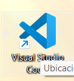

# Expense_tracker.

Aplicación que permite administrar gastos mediante un grafica de barras y hace un conteo de los articulos que se han adquirido .

## Descarga e instalación.

Ejecutar los siguientes comandos.

Paso 1: Clonar el repositorio.

```nginx
git clone https://github.com/LuisFer27/expense_tracker.git
```

Paso 2 :Abrir visual studio code.



Paso 3 seleccionar la carpeta en donde se guardo el repositorio en la opción  archivo y abrir carpeta.


se selecciona la carpeta en donde esta ubicado el repositorio ya que en este caso esta almacenado en documentos pero puede variar según el lugar en de lo tengas descargado.


Paso 4  una vez abierta la carpeta nos apareceran todas estas carpetas sin embargo la que nos interesa es la de lib en donde se alamcena todo los archivos dart para la ejecución de la aplicación.


Paso 5 abriremos la carpeta lib y nos dirigiremos al archivo main .dart.


abrimos el archivo main.dart y se nos visualizara de esta forma ya que aquí al ser la primera aplicación que se trabajo en fluter se simplifco todo para que solo funcionara a partir de aqui ya que en routes especificamente en la carpeta templates se encuentra el archivo donde esta la función

```dart
import 'package:flutter/material.dart';
import 'package:flutter/services.dart';

import 'package:expense_tracker/widgets/expenses.dart';

var kColorScheme =
    ColorScheme.fromSeed(seedColor: const Color.fromARGB(255, 96, 59, 181));
var kDarkColorScheme = ColorScheme.fromSeed(
    brightness: Brightness.dark,
    seedColor: const Color.fromARGB(255, 96, 59, 181));

void main() {
  // WidgetsFlutterBinding.ensureInitialized();
  // SystemChrome.setPreferredOrientations([
  //   DeviceOrientation.portraitUp,
  // ]).then((fn) {
  runApp(
    MaterialApp(
      darkTheme: ThemeData.dark().copyWith(
        useMaterial3: true,
        colorScheme: kDarkColorScheme,
        cardTheme: const CardTheme().copyWith(
          color: kDarkColorScheme.secondaryContainer,
          margin: const EdgeInsets.symmetric(
            horizontal: 16,
            vertical: 8,
          ),
        ),
        elevatedButtonTheme: ElevatedButtonThemeData(
          style: ElevatedButton.styleFrom(
            backgroundColor: kDarkColorScheme.primaryContainer,
            foregroundColor: kDarkColorScheme.onPrimaryContainer,
          ),
        ),
      ),
      theme: ThemeData().copyWith(
          useMaterial3: true,
          colorScheme: kColorScheme,
          appBarTheme: const AppBarTheme().copyWith(
            backgroundColor: kColorScheme.onPrimaryContainer,
            foregroundColor: kColorScheme.primaryContainer,
          ),
          cardTheme: const CardTheme().copyWith(
            color: kColorScheme.secondaryContainer,
            margin: const EdgeInsets.symmetric(
              horizontal: 16,
              vertical: 8,
            ),
          ),
          elevatedButtonTheme: ElevatedButtonThemeData(
            style: ElevatedButton.styleFrom(
              backgroundColor: kColorScheme.primaryContainer,
            ),
          ),
          textTheme: ThemeData().textTheme.copyWith(
              titleLarge: TextStyle(
                  fontWeight: FontWeight.bold,
                  color: kColorScheme.onSecondaryContainer,
                  fontSize: 16))),
      home: const Expenses(),
    ),
  );
  //});
}

```

en este caso en el editor le daremos click en run


depende del dispositivo que dispongamos este se ejecutar si no podemos cambiarlo abajo de nuestro editor 


y escoger nuestro dispositivo principalmente movil ya que en este caso podemos seleccionar movil o virtual como en este ejemplo


## Funcionalidad.

Pantalla principal: se visualiza las graficas de barras que contiene la aplicación ya que esta dividida en categorias que son ocio(icono de cine),comida(icono hamburguesa),viajes(icono avión despegando) y trabajo(icono maleta) ademas se visualiza una lista de todos los registros almacenados en la aplicación


Botón de más permite: abrir un formulario en formato modal para ingresar los datos que se desean guardar se adaptara después a firebase el formulario.

Formulario: permite añadir datos en los campos titulo y importe al igual seleccionar la fecha en la que se realizo dicho gasto y las categorias disponibles dentro de la aplicación como lo son ocio,viaje,comida,trabajo.


Botones:

Botón guardar gasto:permite guardar los gastos y almacenarlos dentro de la aplicación.

botón cancelar:Permite cancelar la acción de guardado ya que no guarda ningún dato al salir del formulario.
